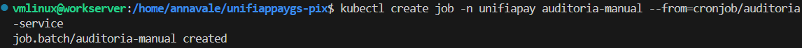

# 📊 Evidências do Desafio - UniFIAP Pay Sistema PIX

**RM554379 - Anna Vale**  
**Disciplina:** Global Solutions - FIAP  
**Projeto:** Sistema de Pagamento PIX (SPB)

---

## 📋 Índice de Evidências

Este documento descreve as evidências que devem ser capturadas para comprovar o cumprimento dos requisitos do desafio.

### Evidência 3.1 - Imagens Publicadas no Docker Hub

**Requisito:** Publicar imagens Docker no Docker Hub com tag contendo o RM.

**Capturas necessárias:**

3. **Comando para verificar imagens localmente:**

### Evidência 3.2 - ConfigMap e Secret

**Requisito:** Utilizar ConfigMap para reserva bancária e Secret para chave PIX.

**Captura necessária:**

### Evidência 3.3 - PersistentVolume e Replicação

**Requisito:** 
- PersistentVolume compartilhado entre API e Auditoria
- 2 réplicas da API de Pagamentos
- CronJob para Auditoria a cada 6 horas

4. **Conteúdo do Livro-Razão (antes da liquidação):**

POD_NAME=$(kubectl get pods -n unifiapay -l app=api-pagamentos -o jsonpath='{.items[0].metadata.name}')
kubectl exec -n unifiapay $POD_NAME -- cat /var/logs/api/instrucoes.log

Deve mostrar entradas com: `AGUARDANDO_LIQUIDACAO`

5. **Conteúdo do Livro-Razão (depois da liquidação):**

# Executar auditoria manualmente
kubectl create job -n unifiapay auditoria-manual --from=cronjob/auditoria-service

# Verificar log atualizado
POD_NAME=$(kubectl get pods -n unifiapay -l app=api-pagamentos -o jsonpath='{.items[0].metadata.name}')
kubectl exec -n unifiapay $POD_NAME -- cat /var/logs/api/instrucoes.log

Deve mostrar entradas com: `LIQUIDADO`

---

### Evidência 3.4 - Requisitos de Segurança

**Requisito:** 
- Containers rodando como usuário não-root
- Limites de recursos definidos
- Imagens otimizadas (multi-stage build)

**Capturas necessárias:**

1. **SecurityContext configurado:**

kubectl get pod -n unifiapay -l app=api-pagamentos -o yaml | grep -A 10 securityContext

2. **Limites de recursos:**

kubectl describe deployment api-pagamentos -n unifiapay | grep -A 10 "Limits:"

Deve mostrar:

Limits:
  cpu:     200m
  memory:  256Mi
Requests:
  cpu:     100m
  memory:  128Mi

3. **Dockerfile Multi-Stage:**
docker build -t annafvale/api-pagamentos-spb:v1.RM554379 ./api-pagamentos

4. **Tamanho das imagens otimizadas:**

docker images | grep annafvale

## 🧪 Evidências de Funcionamento

### Teste 1: PIX Aprovado

**Comando:**

curl -X POST http://localhost:3000/pix \
  -H "Content-Type: application/json" \
  -d '{"id_transacao": "TXN001", "valor": 150.50}'

{"status":"PIX Aceito","transacao":"TXN001","estado":"AGUARDANDO_LIQUIDACAO"}

### Teste 2: PIX Rejeitado

**Comando:**

curl -X POST http://localhost:3000/pix \
  -H "Content-Type: application/json" \
  -d '{"id_transacao": "TXN002", "valor": 2000000.00}'

### Teste 3: Logs da API

kubectl logs -n unifiapay -l app=api-pagamentos --tail=20

### Teste 4: Execução da Auditoria

**Comando:**

kubectl create job -n unifiapay auditoria-manual --from=cronjob/auditoria-service
kubectl logs -n unifiapay job/auditoria-manual

## 🎯 Visão Geral dos Recursos

**Desenvolvido por Anna Vale (RM554379) - FIAP 2025**
