# 🏦 UniFIAP Pay - Sistema de Pagamento PIX (SPB)

> **Simulação do Sistema de Pagamentos Brasileiro com Kubernetes e Docker**

[](https://hub.docker.com/u/annafvale)
[](https://kind.sigs.k8s.io/)
[](https://nodejs.org/)

**RM:** RM554379  
**Aluno:** Anna Vale  
**Repositório:** [github.com/annafvale26/unifiappaygs-pix](https://github.com/annafvale26/unifiappaygs-pix)  
**Docker Hub:** [hub.docker.com/u/annafvale](https://hub.docker.com/u/annafvale)

---

## 📋 Sobre o Projeto

Sistema de pagamento PIX desenvolvido para o desafio Global Solutions da FIAP, implementando uma arquitetura de microsserviços que simula o fluxo completo de transações do Sistema de Pagamentos Brasileiro (SPB).

### 🎯 Funcionalidades

✅ **API de Pagamentos** - Validação e registro de transações PIX  
✅ **Sistema de Auditoria** - Liquidação automática via CronJob (6h)  
✅ **Livro-Razão Compartilhado** - PersistentVolume entre serviços  
✅ **Alta Disponibilidade** - 2 réplicas da API com load balancing  
✅ **Segurança** - Containers non-root, limites de recursos, secrets  
✅ **Deploy Automatizado** - Scripts de build, push e deploy

## 🏗️ Arquitetura do Projeto

```
┌─────────────────────────────────────────────────────────────┐
│                    Kubernetes Cluster (KIND)                │
│                                                             │
│  ┌────────────────────────────────────────────────────┐     │
│  │         Namespace: unifiapay                       │     │
│  │                                                    │     │
│  │  ┌──────────────────┐      ┌──────────────────┐    │     │
│  │  │  API Pagamentos  │      │  Auditoria       │    │     │
│  │  │  (Deployment)    │      │  (CronJob 6h)    │    │     │
│  │  │  - 2 Réplicas    │      │  - Liquidação    │    │     │
│  │  │  - Port 3000     │      │                  │    │     │
│  │  └────────┬─────────┘      └────────┬─────────┘    │     │
│  │           │                         │              │     │
│  │           └──────────┬──────────────┘              │     │
│  │                      │                             │     │
│  │           ┌──────────▼──────────┐                  │     │
│  │           │  PersistentVolume   │                  │     │
│  │           │   (Livro-Razão)     │                  │     │
│  │           │  /var/logs/api/     │                  │     │
│  │           └─────────────────────┘                  │     │
│  │                                                    │     │
│  │  ConfigMap: RESERVA_BANCARIA_SALDO = 1000000.00    │     │
│  │  Secret: pix.key = sim-key-abcdef-123456...        │     │
│  └────────────────────────────────────────────────────┘     │
└─────────────────────────────────────────────────────────────┘
```

## 📁 Estrutura do Projeto

```
unifiappaygs-pix/
├── api-pagamentos/              # 🔵 Microsserviço API de Pagamentos
│   ├── src/index.js            #    Lógica de validação e registro PIX
│   ├── Dockerfile              #    Multi-stage build otimizado
│   └── package.json
├── auditoria-service/           # 🟢 Microsserviço de Auditoria/Liquidação
│   ├── src/index.js            #    Processamento batch de liquidação
│   ├── Dockerfile              #    Multi-stage build otimizado
│   └── package.json
├── k8s/                         # ⚙️ Manifests Kubernetes
│   ├── 01-namespace-config-secret.yaml
│   ├── 02-pvc.yaml
│   ├── 03-api-deployment.yaml
│   ├── 03b-api-service.yaml
│   └── 04-auditoria-cronjob.yaml
├── scripts/                     # 🚀 Automação
│   ├── build.sh                #    Build das imagens Docker
│   ├── push.sh                 #    Push para Docker Hub
│   ├── deploy.sh               #    Deploy no Kubernetes
│   ├── setup-completo.sh       #    Setup completo do projeto
│   ├── gerar-evidencias.sh     #    Gerar outputs para evidências
│   └── verificar-status.sh     #    Status dos recursos
├── assets/                      # 📸 Evidências (20+ screenshots)
└── README.md                    # 📖 Este arquivo
```

## 🚀 Pré-requisitos

- **Docker** (versão 20.10+)
- **kubectl** (versão 1.25+)
- **KIND** (Kubernetes IN Docker)
- **Node.js** 20+ (para desenvolvimento local)
- **Conta no Docker Hub** (annafvale)

### Instalação do KIND no Ubuntu/WSL

```bash
# Instalar KIND
curl -Lo ./kind https://kind.sigs.k8s.io/dl/v0.20.0/kind-linux-amd64
chmod +x ./kind
sudo mv ./kind /usr/local/bin/kind

# Verificar instalação
kind version
```

## 📦 Como Executar

### 1. Criar Cluster Kubernetes LOCAL (KIND)

```bash
# Criar cluster KIND
kind create cluster --name unifiapay-cluster

# Verificar cluster
kubectl cluster-info --context kind-unifiapay-cluster
kubectl get nodes
```

### 2. Build das Imagens Docker

```bash
# Build da API de Pagamentos
cd api-pagamentos
docker build -t annafvale/api-pagamentos-spb:v1.RM554379 .

# Build do Serviço de Auditoria
cd ../auditoria-service
docker build -t annafvale/auditoria-service-spb:v1.RM554379 .

# Voltar para raiz
cd ..
```

**Ou use o script de automação:**

```bash
chmod +x scripts/build.sh
./scripts/build.sh
```

### 3. Push para Docker Hub

```bash
# Login no Docker Hub
docker login -u annafvale

# Push das imagens
docker push annafvale/api-pagamentos-spb:v1.RM554379
docker push annafvale/auditoria-service-spb:v1.RM554379
```

**Ou use o script:**

```bash
chmod +x scripts/push.sh
./scripts/push.sh
```

### 4. Deploy no Kubernetes

```bash
# Aplicar todos os manifestos em ordem
kubectl apply -f k8s/01-namespace-config-secret.yaml
kubectl apply -f k8s/02-pvc.yaml
kubectl apply -f k8s/03-api-deployment.yaml
kubectl apply -f k8s/04-auditoria-cronjob.yaml

# Verificar recursos criados
kubectl get all -n unifiapay
kubectl get pvc -n unifiapay
kubectl get configmap -n unifiapay
kubectl get secret -n unifiapay
```

**Ou use o script:**

```bash
chmod +x scripts/deploy.sh
./scripts/deploy.sh
```

### 5. Expor a API (Port Forward)

```bash
# Port forward para acessar a API localmente
kubectl port-forward -n unifiapay deployment/api-pagamentos 3000:3000
```

A API estará disponível em: `http://localhost:3000`

## 🧪 Testes

### Testar Endpoint POST /pix

```bash
# PIX APROVADO - Valor dentro da reserva
curl -X POST http://localhost:3000/pix \
  -H "Content-Type: application/json" \
  -d '{
    "id_transacao": "TXN001",
    "valor": 150.50
  }'

# Resposta esperada:
# {"status":"PIX Aceito","transacao":"TXN001","estado":"AGUARDANDO_LIQUIDACAO"}

# PIX REJEITADO - Valor acima da reserva
curl -X POST http://localhost:3000/pix \
  -H "Content-Type: application/json" \
  -d '{
    "id_transacao": "TXN002",
    "valor": 2000000.00
  }'

# Resposta esperada:
# {"status":"PIX Rejeitado","motivo":"Fundos insuficientes na Reserva Bancária."}
```

### Verificar Logs do Livro-Razão

```bash
# Listar pods da API
kubectl get pods -n unifiapay -l app=api-pagamentos

# Acessar o pod (substitua <pod-name> pelo nome real)
kubectl exec -it -n unifiapay <pod-name> -- sh

# Dentro do pod, ver o arquivo de log
cat /var/logs/api/instrucoes.log

# Exemplo de saída:
# 2025-11-12T10:15:30.123Z | TXN001 | 150.50 | AGUARDANDO_LIQUIDACAO
```

### Forçar Execução da Auditoria (Teste Manual)

```bash
# Criar um Job a partir do CronJob
kubectl create job -n unifiapay auditoria-manual --from=cronjob/auditoria-service

# Verificar execução do Job
kubectl get jobs -n unifiapay
kubectl logs -n unifiapay job/auditoria-manual

# Verificar se o status foi atualizado para LIQUIDADO
kubectl exec -it -n unifiapay <pod-api> -- cat /var/logs/api/instrucoes.log
```

## 🔒 Segurança Implementada

### Evidência 3.4 - Requisitos de Segurança

1. **Imagens Multi-Stage Build**
   - Redução do tamanho das imagens
   - Apenas dependências de produção

2. **Usuário Não-Root**
   - Containers executam com `runAsNonRoot: true`
   - Usuário `appuser` (UID 1000)

3. **Limites de Recursos**
   - CPU: 100m (request) / 200m (limit)
   - Memory: 128Mi (request) / 256Mi (limit)

4. **Secrets para Dados Sensíveis**
   - Chave PIX armazenada como Secret
   - ConfigMap para configurações não-sensíveis

---

## 📊 Evidências do Desafio

### 📦 Evidência 3.1 - Imagens Docker Hub

**Imagens publicadas com tag RM554379:**

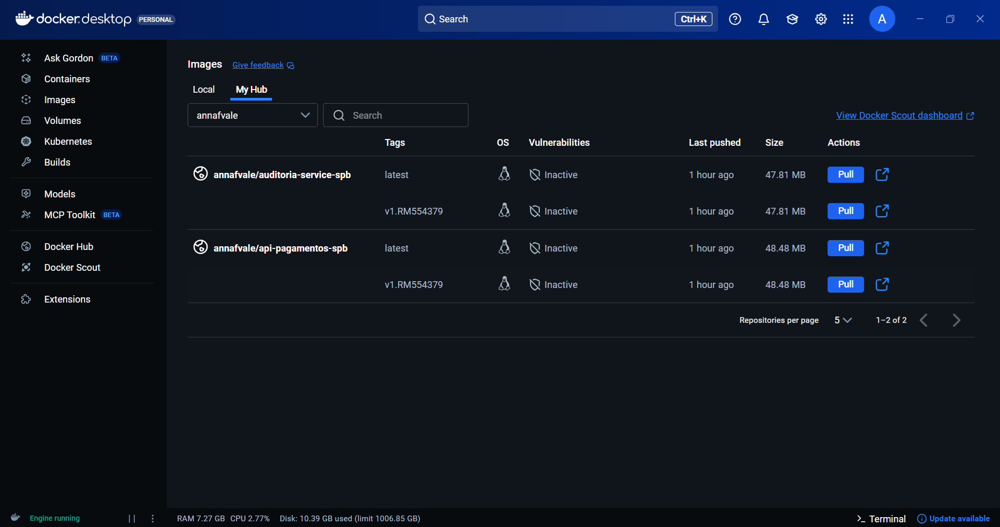
*Docker Hub com as duas imagens: api-pagamentos-spb e auditoria-service-spb*

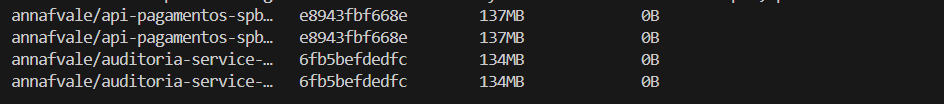
*Verificação local das imagens Docker construídas*

**Links Docker Hub:**
- 🔵 [annafvale/api-pagamentos-spb:v1.RM554379](https://hub.docker.com/r/annafvale/api-pagamentos-spb)
- 🟢 [annafvale/auditoria-service-spb:v1.RM554379](https://hub.docker.com/r/annafvale/auditoria-service-spb)

**Comando para pull:**
```bash
docker pull annafvale/api-pagamentos-spb:v1.RM554379
docker pull annafvale/auditoria-service-spb:v1.RM554379
```

---

### ⚙️ Evidência 3.2 - ConfigMap e Secret

**ConfigMap com reserva bancária e Secret com chave PIX:**

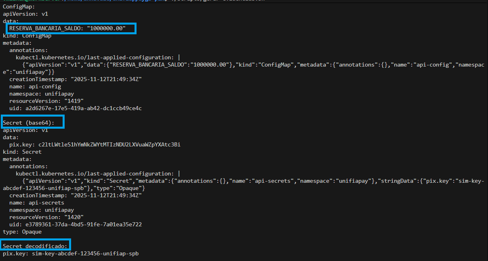
*ConfigMap `api-config` com `RESERVA_BANCARIA_SALDO=1000000.00` e Secret `api-secrets` com chave PIX*

**Comando para verificar:**
```bash
kubectl describe configmap api-config -n unifiapay
kubectl get secret api-secrets -n unifiapay -o yaml
```

---

### 💾 Evidência 3.3 - PersistentVolume e Replicação

**1. PersistentVolumeClaim compartilhado:**

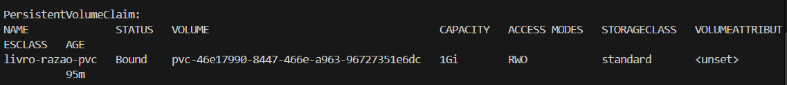
*PVC `livro-razao-pvc` (1Gi) compartilhado entre API e Auditoria*

**2. Deployment com 2 réplicas:**

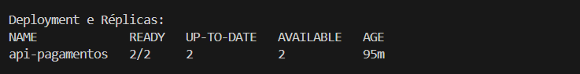
*API de Pagamentos rodando com 2/2 réplicas (alta disponibilidade)*

**2.1. Escalabilidade - 4 réplicas:**

```bash
# Escalar deployment para 4 réplicas
kubectl scale deployment api-pagamentos -n unifiapay --replicas=4

# Verificar escalabilidade
kubectl get pods -n unifiapay -l app=api-pagamentos
```
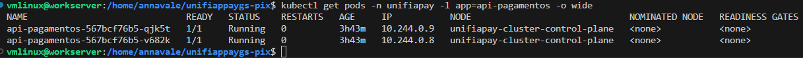


*Sistema demonstrando escalabilidade horizontal: de 2 para 4 réplicas dinamicamente*  
*4 pods rodando simultaneamente compartilhando o mesmo PersistentVolume*

**3. CronJob agendado para 6h:**

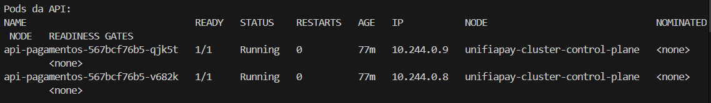
*CronJob de Auditoria agendado para executar a cada 6 horas (0 */6 * * *)*

**4. Recursos no namespace unifiapay:**

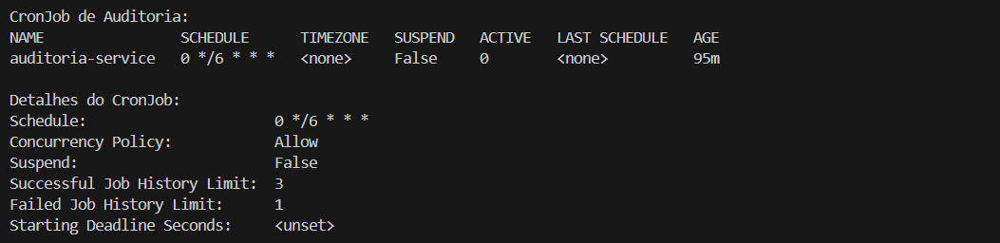
*Visão geral de todos os recursos (pods, services, deployments, cronjobs)*

**5. Livro-Razão ANTES da liquidação:**

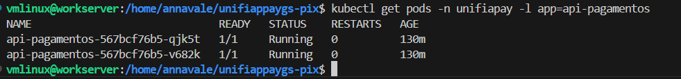
*Transações com status `AGUARDANDO_LIQUIDACAO`*

**6. Execução manual da Auditoria:**

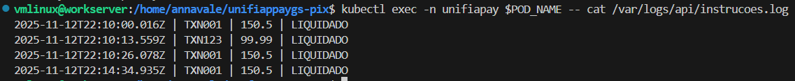
*Criação de Job manual a partir do CronJob para teste*

**7. Livro-Razão DEPOIS da liquidação:**

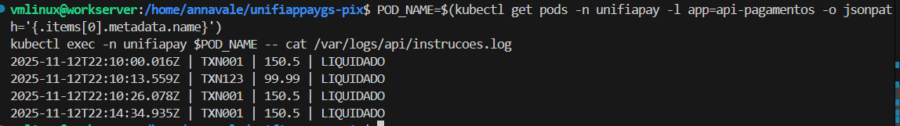
*Transações com status atualizado para `LIQUIDADO`*

**Comandos:**
```bash
# Ver PVC
kubectl get pvc -n unifiapay

# Ver réplicas
kubectl get deployment api-pagamentos -n unifiapay

# Ver CronJob
kubectl get cronjob -n unifiapay

# Forçar execução manual
kubectl create job -n unifiapay auditoria-manual --from=cronjob/auditoria-service
```

---

### 🔒 Evidência 3.4 - Requisitos de Segurança

**1. SecurityContext - Usuário não-root:**

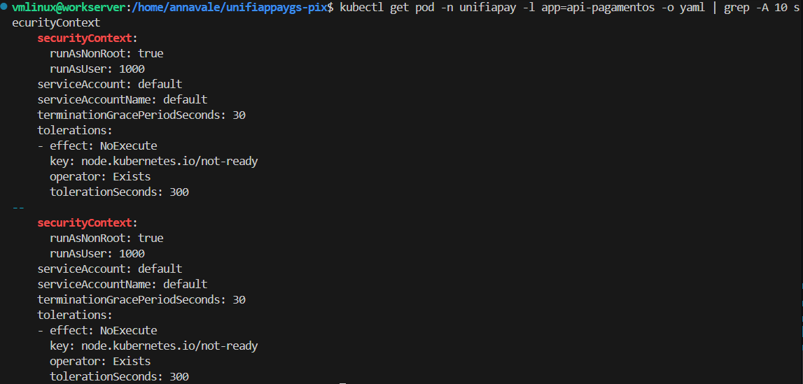
*Containers executando com `runAsNonRoot: true` e usuário `appuser` (UID 1000)*

**2. Limites de recursos definidos:**

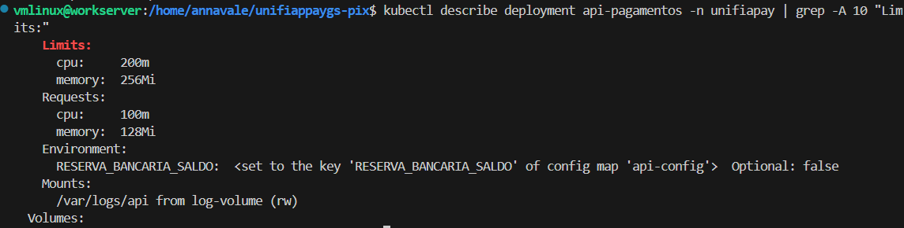
*CPU: 100m-200m | Memory: 128Mi-256Mi por container*

**3. Multi-stage build otimizado:**

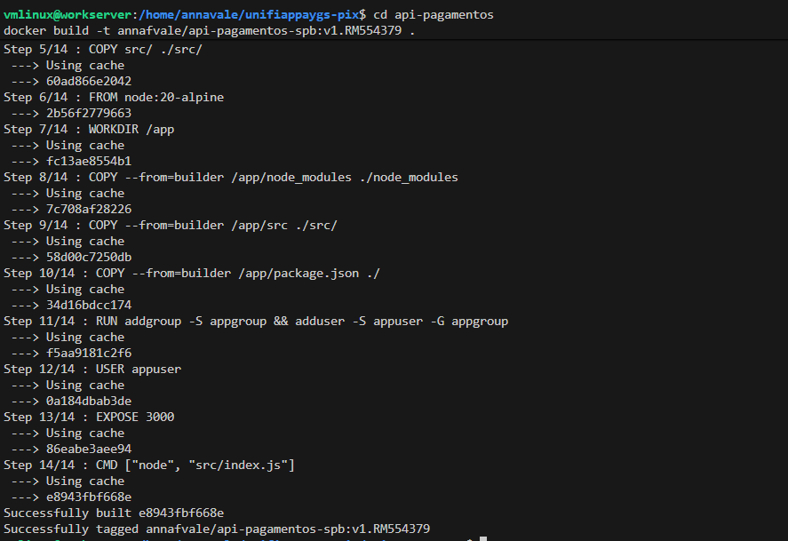
*Build multi-stage reduzindo tamanho das imagens*

**4. Imagens otimizadas:**

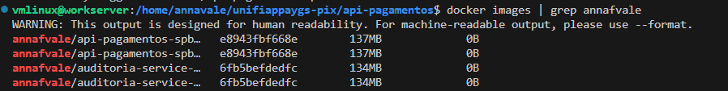
*Imagens Alpine (~200MB) vs imagens tradicionais (~1GB)*

**Comandos de verificação:**
```bash
# SecurityContext
kubectl get pod -n unifiapay -l app=api-pagamentos -o yaml | grep -A 10 securityContext

# Resource Limits
kubectl describe deployment api-pagamentos -n unifiapay | grep -A 10 "Limits:"

# Tamanho das imagens
docker images | grep annafvale
```

---

## 🧪 Evidências de Funcionamento

### ✅ Teste 1: PIX Aprovado (Valor dentro da reserva)

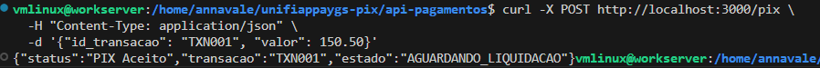

**Comando:**
```bash
curl -X POST http://localhost:3000/pix \
  -H "Content-Type: application/json" \
  -d '{"id_transacao": "TXN001", "valor": 150.50}'
```

**Resposta:**
```json
{"status":"PIX Aceito","transacao":"TXN001","estado":"AGUARDANDO_LIQUIDACAO"}
```

---

### ❌ Teste 2: PIX Rejeitado (Valor acima da reserva)

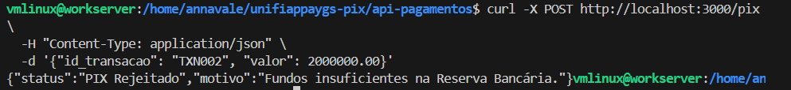

**Comando:**
```bash
curl -X POST http://localhost:3000/pix \
  -H "Content-Type: application/json" \
  -d '{"id_transacao": "TXN002", "valor": 2000000.00}'
```

**Resposta:**
```json
{"status":"PIX Rejeitado","motivo":"Fundos insuficientes na Reserva Bancária."}
```

---

### 📋 Teste 3: Logs da API

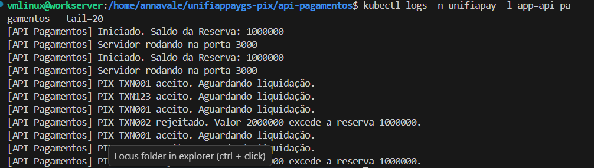

**Comando:**
```bash
kubectl logs -n unifiapay -l app=api-pagamentos --tail=20
```

Mostra requisições recebidas, validações e gravações no livro-razão.

---

### 🔄 Teste 4: Execução da Auditoria/Liquidação

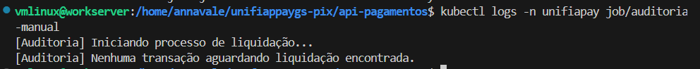

**Comando:**
```bash
kubectl create job -n unifiapay auditoria-manual --from=cronjob/auditoria-service
kubectl logs -n unifiapay job/auditoria-manual
```

Mostra processamento de transações e atualização de status para `LIQUIDADO`.

---

### 🎯 Visão Geral do Sistema

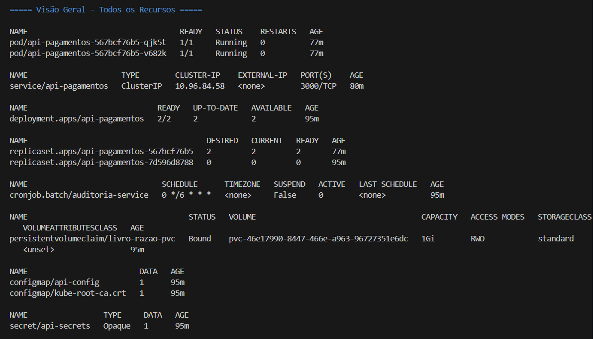

*Todos os recursos do sistema funcionando em harmonia no cluster Kubernetes*

## 🛠️ Comandos Úteis

```bash
# Ver logs da API
kubectl logs -n unifiapay -l app=api-pagamentos --tail=50 -f

# Ver logs do CronJob de Auditoria
kubectl logs -n unifiapay -l job-name=auditoria-service-<timestamp>

# Deletar todos os recursos
kubectl delete namespace unifiapay

# Recriar deployment (após mudanças)
kubectl rollout restart deployment api-pagamentos -n unifiapay

# Deletar cluster KIND
kind delete cluster --name unifiapay-cluster
```

## 🐛 Troubleshooting

### Pods não iniciam

```bash
# Verificar eventos do pod
kubectl describe pod -n unifiapay <pod-name>

# Verificar logs de erro
kubectl logs -n unifiapay <pod-name>
```

### Imagens não encontradas no Docker Hub

```bash
# Verificar se fez push
docker images | grep annafvale

# Verificar credenciais
docker login -u annafvale
```

### PVC em Pending

```bash
# Verificar se o StorageClass existe
kubectl get storageclass

# No KIND, o StorageClass padrão deve existir automaticamente
kubectl get pvc -n unifiapay -o yaml
```

### Port Forward não funciona

```bash
# Verificar se o pod está rodando
kubectl get pods -n unifiapay

# Verificar se a porta 3000 está livre localmente
lsof -i :3000
```

---

## 🛠️ Scripts de Automação

O projeto inclui scripts para facilitar o desenvolvimento e deploy:

| Script | Descrição |
|--------|-----------|
| `build.sh` | Build das imagens Docker |
| `push.sh` | Push para Docker Hub (requer login) |
| `deploy.sh` | Deploy no Kubernetes |
| `setup-completo.sh` | Setup completo (build + push + deploy) |
| `gerar-evidencias.sh` | Gerar outputs para capturas de tela |
| `verificar-status.sh` | Verificar status dos recursos |
| `cleanup.sh` | Limpar recursos do cluster |

**Uso:**
```bash
chmod +x scripts/*.sh
./scripts/setup-completo.sh  # Setup completo automático
```

---

## 🐛 Troubleshooting

<details>
<summary><strong>🔴 Pods não iniciam</strong></summary>

```bash
# Verificar eventos do pod
kubectl describe pod -n unifiapay <pod-name>

# Verificar logs de erro
kubectl logs -n unifiapay <pod-name>
```
</details>

<details>
<summary><strong>🔴 Imagens não encontradas</strong></summary>

```bash
# Verificar se fez push
docker images | grep annafvale

# Fazer push novamente
./scripts/push.sh
```
</details>

<details>
<summary><strong>🔴 PVC em Pending</strong></summary>

```bash
# Verificar StorageClass (KIND tem padrão)
kubectl get storageclass

# Ver detalhes do PVC
kubectl describe pvc livro-razao-pvc -n unifiapay
```
</details>

<details>
<summary><strong>🔴 Port Forward não funciona</strong></summary>

```bash
# Verificar se pods estão rodando
kubectl get pods -n unifiapay

# Verificar se porta 3000 está livre
lsof -i :3000

# Matar processo usando a porta
kill -9 $(lsof -t -i:3000)
```
</details>

---

## 📚 Tecnologias Utilizadas

- **Runtime:** Node.js 20 (Alpine Linux)
- **Framework:** Express.js 4.18
- **Containerização:** Docker (multi-stage builds)
- **Orquestração:** Kubernetes (KIND local cluster)
- **Gerenciamento Visual:** Kubernetes Dashboard
- **Registro:** Docker Hub
- **Armazenamento:** PersistentVolume (hostPath)
- **Segurança:** Non-root containers, resource limits, secrets

---

### 🔄 Rancher vs Kubernetes Dashboard

Inicialmente, planejou-se utilizar o **Rancher** como ferramenta de gerenciamento visual do cluster. Porém, devido a **incompatibilidade de versão** (Rancher requer Kubernetes < 1.34.0 e o cluster está na v1.34.1), optou-se pelo **Kubernetes Dashboard oficial**.

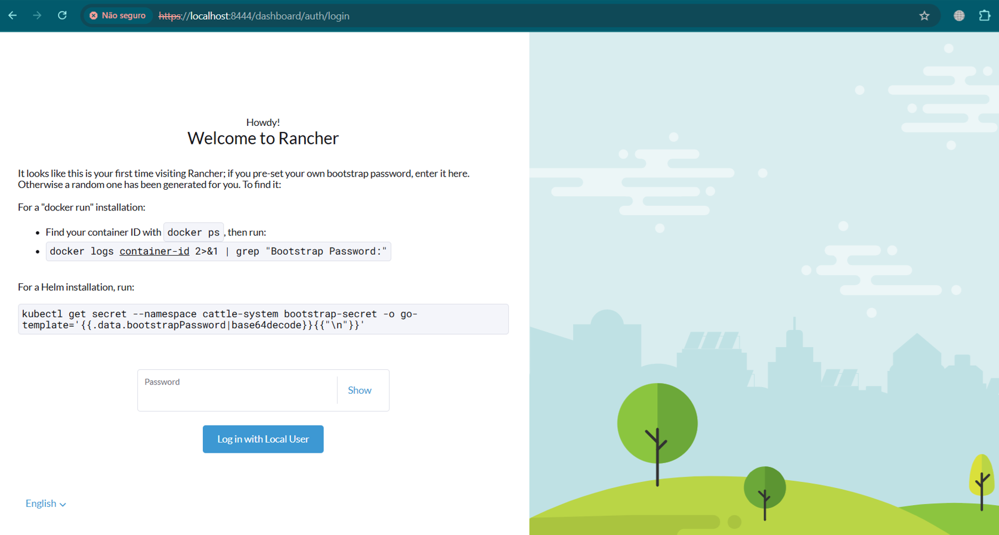

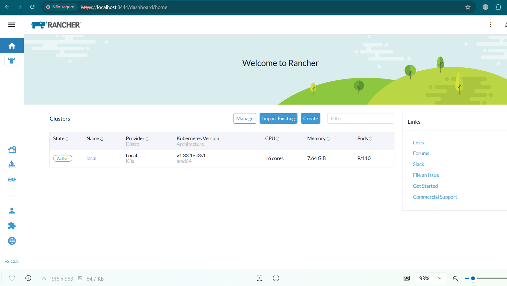


## 🖥️ Interface Visual - Kubernetes Dashboard

Para facilitar o gerenciamento e visualização dos recursos do cluster, foi implementado o **Kubernetes Dashboard**.

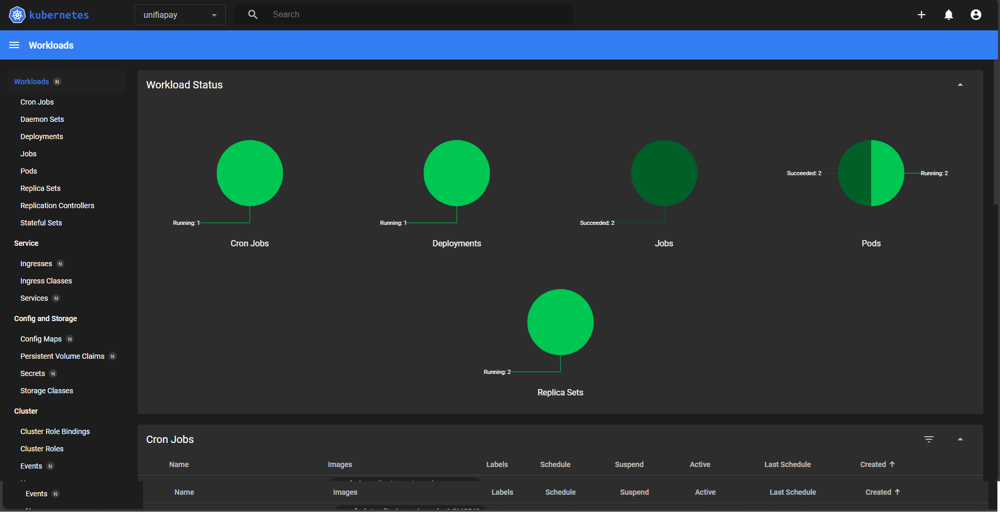

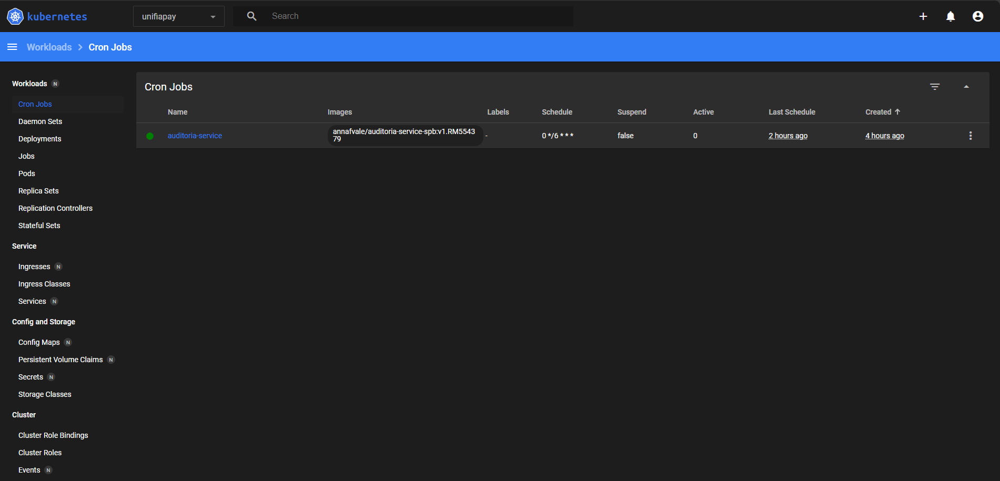

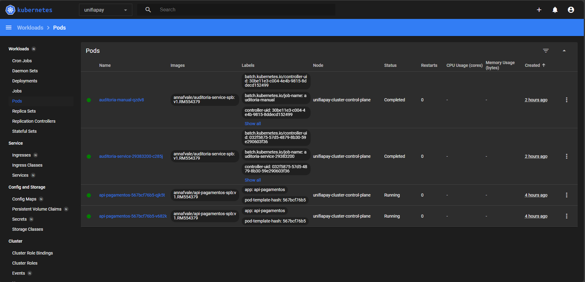


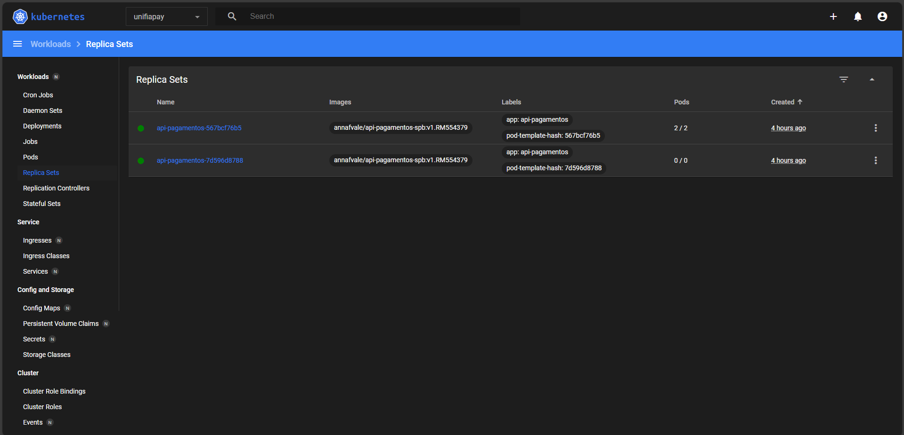


### ✅ Vantagens do Kubernetes Dashboard:

- ✅ **Compatível** com todas as versões do Kubernetes
- ✅ **Oficial** e mantido pela comunidade Kubernetes
- ✅ **Leve** e rápido
- ✅ **Interface completa** para gerenciar pods, deployments, services
- ✅ **Visualização em tempo real** de logs e métricas
- ✅ **Escalabilidade visual** - escalar réplicas com um clique

### 🚀 Como acessar o Dashboard neste projeto:

```bash
# 1. Iniciar o proxy
kubectl proxy --port=8085

# 2. Gerar token de acesso
kubectl -n kubernetes-dashboard create token admin-user --duration=24h

# 3. Acessar no navegador
# http://localhost:8085/api/v1/namespaces/kubernetes-dashboard/services/https:kubernetes-dashboard:/proxy/

# 4. Login com o token gerado
```

### 📊 Recursos gerenciados via Dashboard:

- 🟢 **4 réplicas da API** - Escalabilidade horizontal demonstrada
- 📦 **Deployments e Services** - Gerenciamento visual
- 💾 **PersistentVolumes** - Monitoramento de armazenamento
- 📝 **Logs centralizados** - Visualização de todos os pods
- ⚙️ **ConfigMaps e Secrets** - Gerenciamento de configurações
- 🔄 **CronJobs** - Monitoramento de jobs agendados

---

## 📖 Referências

- 📘 [Kubernetes Documentation](https://kubernetes.io/docs/)
- 📘 [KIND - Kubernetes IN Docker](https://kind.sigs.k8s.io/)
- 📘 [Docker Documentation](https://docs.docker.com/)
- 📘 [Node.js Express Framework](https://expressjs.com/)
- 📘 [Sistema de Pagamentos Brasileiro (SPB)](https://www.bcb.gov.br/estabilidadefinanceira/spb)
- 📘 [PIX - Banco Central do Brasil](https://www.bcb.gov.br/estabilidadefinanceira/pix)

---

## 🎓 Sobre o Desafio

Este projeto foi desenvolvido como parte do desafio **Global Solutions 2025** da **FIAP**, demonstrando conhecimentos em:

✅ Containerização com Docker  
✅ Orquestração com Kubernetes  
✅ Arquitetura de Microsserviços  
✅ CI/CD e DevOps  
✅ Segurança em Containers  
✅ Sistemas de Pagamento (SPB/PIX)  

---

## 📝 Licença

Este projeto foi desenvolvido para fins **educacionais** como parte do desafio Global Solutions da FIAP.

---

<div align="center">

**Desenvolvido por Anna Vale (RM554379)**  
**FIAP - Global Solutions 2025**

[](https://github.com/annafvale26/unifiappaygs-pix)
[](https://hub.docker.com/u/annafvale)

</div>